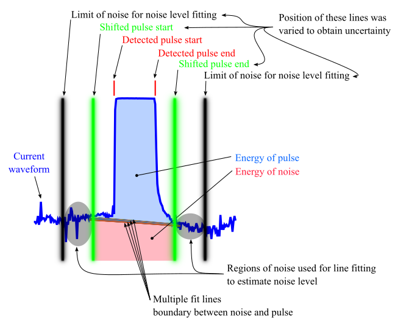

# Scripts for calculation of energy dissipated in braking rheostats
Developed in the scope of MyRails project. Works in GNU Octave/Matlab. Based on the paper: *Accurate
Measurement of Energy Dissipated in Braking Rheostats in DC Railway Systems*, Helko van den Brom,
Domenico Giordano, Danielle Gallo, Andreas Wank, Yljon Seferi

## How to run
- Make some directory with following files with measured waveforms:
    - IrogA.mat
    - IrogB.mat
    - Vdwnf.mat
    - Vhf.mat
- Set sampling frequency by editing first lines of file ```calculate.m```.
- Set path to directory with measurement data by editing first lines of file ```calculate.m```.
- Set if plots are desired or not by editing first lines of file ```calculate.m```.
- Run ```calculate``` in GNU Octave or Matlab.

## Features
- Chopping frequency nor sampling frequency do not have to be exact nor precise. Braking pulses in current waveform are identified by finding starts and ends of pulses.
- Pulses are identified by setting trigger level voltage, this voltage is found heuristically.
- Waveforms are splitted into braking groups, New braking group is found if no braking happens for at least 1 second.
- The energy is calculated in two ways (configurations): ```Vhf*Ia + (Vdsf-Vhf)*Ib```, and ```Vhf*Ib + (Vdsf-Vhf)*Ia```,
  alternately for every pulse.
- For every group both configurations are calculated.
- Final value is estimated from all possibilities from 2 configurations for every group - if too
  many groups, Monte Carlo Method is used.
- Three methods for calculation: ```energy.m```, ```energy2.m```, ```energy3.m```
- Scripts ```calculate(2,3).m``` reports both energies.
- Script is optimised to use more harddrive than memory so even desktop computers should be able to
  run it. However every file IrogA.mat etc. have to be loaded at least once into memory and this
  action can easily eat 4 - 8 GB of RAM depending on the system, and calculation is slow.
- Internally script use variable names as in the paper, so renaming of variables happens.

## energy.m
- First tested method.
- Just calculates energy of all.

## energy2.m
- Second tested method.
- Differentiate braking pulses and noise between pulses.
- Noise in between pulses is takes about 30 % of all energy in the signal.

## energy3.m
- Third tested method.
- Braking pulse energy is calculated by fitting surrounding noise and subtracting fitted noise from
  pulse.
- The number of samples between pulse start/end and shifted pulse start/end and noise start/end has
  to be set at the beginning of the script.
- Variation of boundaries to obtain uncertainties:

  

## Issues
- Identification of pulses is based on finding proper trigger level. This can fail at some time.
- Braking groups shows out a consecutive series of pulses. So for every next pulse chopping
  happened. But some braking groups shows missing braking pulses at the end of the group. I have no
  idea if one chopping or two choppping happened during missing pulse.
- I have no idea which noise can be expected and how it can affect pulse detection.

## Assumptions
- Break pulses appears both in Ia and Ib at +- same place.
