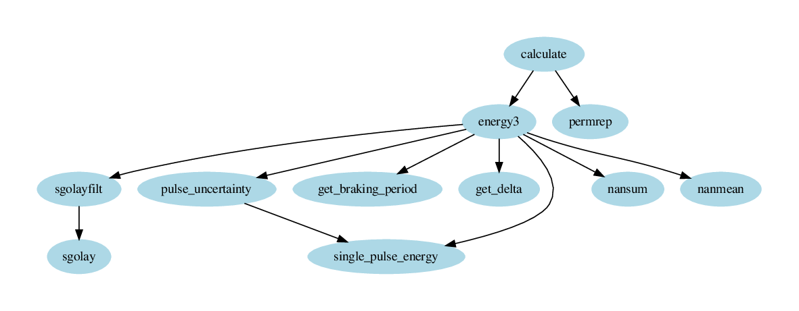

# Scripts for calculation of energy dissipated in braking rheostats
Developed in the scope of MyRails project. Works in GNU Octave/Matlab. Based on the paper: *Accurate
Measurement of Energy Dissipated in Braking Rheostats in DC Railway Systems*, Helko van den Brom,
Domenico Giordano, Danielle Gallo, Andreas Wank, Yljon Seferi

## How to run
- Make some directory with following files with measured waveforms:
    - IrogA.mat
    - IrogB.mat
    - Vdwnf.mat
    - Vhf.mat
- Set sampling frequency by editing first lines of file ```calculate.m```.
- Set path to directory with measurement data by editing first lines of file ```calculate.m```.
- Set if plots are desired or not by editing first lines of file ```calculate.m```.
- Run ```calculate``` in GNU Octave or Matlab.

## Features
- Chopping frequency nor sampling frequency do not have to be exact nor precise. Braking pulses in current waveform are identified by finding starts and ends of pulses.
- Pulses are identified by setting trigger level voltage, this voltage is found heuristically.
- Waveforms are splitted into braking groups for memory efficiency. New braking group is found if no braking happens for at least 1 second.
- The energy is calculated in two ways (configurations): ```Vhf*Ia + (Vdsf-Vhf)*Ib```, and ```Vhf*Ib + (Vdsf-Vhf)*Ia```,
  alternately for every pulse.
- For every group both configurations are calculated.
- Final value is estimated from all possibilities from 2 configurations for every group - if too
  many groups, Monte Carlo Method is used.
- Script is optimised to use more harddrive than memory so even desktop computers should be able to
  run it. However every original file (IrogA.mat etc.) have to be loaded at least once into memory and this
  action can easily eat 4 - 8 GB of RAM depending on the system.
- Internally script use variable names as in the paper, so variables saved in original
  data files are renamed.

## Pulse energy calculation
- Energy of single braking pulse is calculated by fitting surrounding noise and subtracting the noise from
  the pulse.


- The number of samples between Detected pulse start/end, Shifted pulse start/end and Noise start/end has
  to be set in the script energy3.m.
- Energy of noise in between pulses is overestimated because the voltage drop across the rheostat is some (unknown) zero: Vdwnf falls across the GTO.
- Resistance of braking rheostat is estimated based on peak value of current pulse.

## Uncertainty calculation
- Pulse uncertainty is based on monte carlo variating of:
        1. current offset and gain, independently for both currents (two pieces of sensors)
        1. voltage offset and gain, independently for both voltages (two pieces of digitisers)
        1. noise fitting (variation by samplses in range set in energy3.m)
- Uncertainty of all pulses in a group is calculated as linear sum of pulse uncertainties, and this
  is done for both configurations. The reason is the correlation is assumed to be 1 (see GUM
  uncertainty framework, page 21, equation top right).
- Total uncertainty of all pulses in all groups is calculated as maximum of all possible
  permutations of linear sum of group uncertainties.

## Issues
- Identification of pulses is based on finding proper trigger level. This can fail at some time.
- Braking groups shows out a consecutive series of pulses. So for every next pulse chopping
  happened. But some braking groups shows missing braking pulses at the end of the group. I have no
  idea if one chopping or two choppping happened during missing pulse.
- I have no idea which noise can be expected and how it can affect pulse detection.

## Assumptions
- Break pulses appears both in Ia and Ib at +- same place.

## Script dependencies

